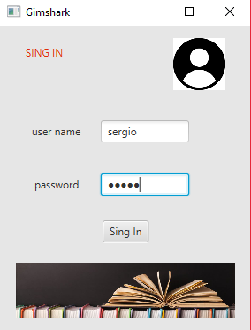
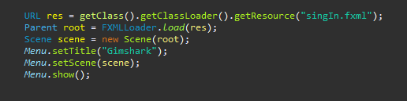
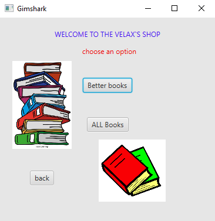
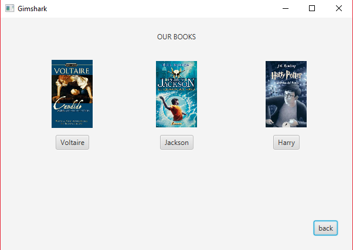
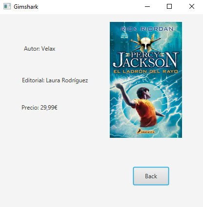
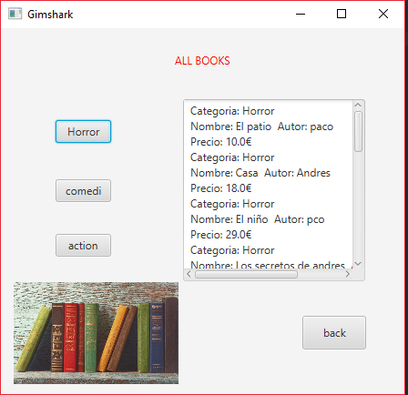

# interfaz

In this proyect we have implemented our code with javaFX.

I have used the scene builder programa to create the pages and the code was created whith javaFX.

At firts we showed the principal pane whith the login section.

I add the code to show the login pane.

# login section
                                                                                      

                                                               

In the second screan we show to costumers two posible functions:

# choose section

After that the user have two options see the main books (books which have more views)

If we select one of the books we can view the book caracteristics.

In the oter hand if we select the other option, we visualice all books with the diferents categories.

